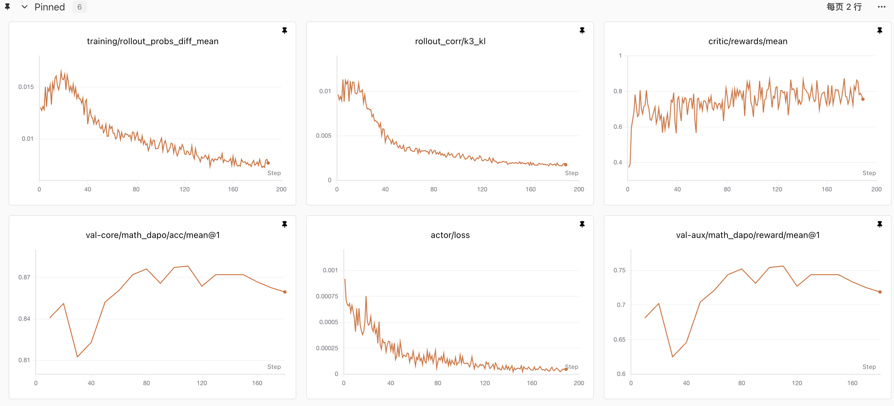

# Hy3 Reinforcement Learning Training

English | [简体中文](./README_CN.md)

This document describes how to run reinforcement learning training for Hy3 with [verl](https://github.com/volcengine/verl). Training runs on [Megatron-LM](https://github.com/NVIDIA/Megatron-LM); NVIDIA [Megatron-Bridge](https://github.com/NVIDIA-NeMo/Megatron-Bridge) (`HYV3Bridge`) converts the HF checkpoint into a Megatron model on the fly at training startup — no offline conversion needed. Rollout runs on [vLLM](https://github.com/vllm-project/vllm).

Training script: [`examples/grpo_trainer/run_hy_v3_megatron.sh`](https://github.com/verl-project/verl/blob/main/examples/grpo_trainer/run_hy_v3_megatron.sh) in the verl repository.

## Quick Start

### Environment

Recommended image: `verlai/verl:vllm023.dev1`

Verified version combination:

| Component | Version |
| --- | --- |
| verl | [220e903](https://github.com/verl-project/verl/commit/220e9039902c6db56860e2afd659803dc34ec005) |
| Megatron-Bridge | [df0852c](https://github.com/NVIDIA-NeMo/Megatron-Bridge/commit/df0852cf94c674de07f9f7ef933c484de8aca505) |
| transformers | 5.6.0 |
| nvidia-modelopt | 0.44.0rc5 |

### Prepare dependencies

Clone verl at the verified version, then clone the dependencies into `third_party/` under the repository root:

```bash
git clone https://github.com/verl-project/verl.git
cd verl
git checkout 220e903

mkdir third_party
git clone https://github.com/NVIDIA-NeMo/Megatron-Bridge.git third_party/Megatron-Bridge
git -C third_party/Megatron-Bridge checkout df0852c

git clone https://github.com/Ascend/TransferQueue.git third_party/TransferQueue
```

Create a `runtime_env.yaml` so the Ray runtime env ships the working directory (including `third_party/`) to every worker node and adds the dependencies to `PYTHONPATH`:

```yaml
# runtime_env.yaml
working_dir: ./
excludes: [
  "/.git/",
  "/third_party/Megatron-Bridge/.git/",
  "/third_party/TransferQueue/.git/",
  "**/__pycache__/",
]
env_vars:
  PYTHONPATH: third_party/Megatron-Bridge/src:third_party/TransferQueue
```

### Prepare the dataset

The script defaults to [DAPO-Math-17k](https://huggingface.co/datasets/BytedTsinghua-SIA/DAPO-Math-17k) (train) and [AIME-2024](https://huggingface.co/datasets/BytedTsinghua-SIA/AIME-2024) (validation). Both are already in the format verl expects on HuggingFace — just download and dump to parquet:

```python
# prepare_data.py
import datasets

dapo = datasets.load_dataset("BytedTsinghua-SIA/DAPO-Math-17k", "default")["train"]
dapo.to_parquet("DAPO-Math-17k/dapo-math-17k.parquet")

aime = datasets.load_dataset("BytedTsinghua-SIA/AIME-2024", "default")["train"]
aime.to_parquet("AIME-2024/aime-2024.parquet")
```

```bash
python prepare_data.py   # output layout matches the script's default DATA_DIR
```

Place the data under the verl repository root (`DATA_DIR` defaults to `$PWD`), or point elsewhere with `DATA_DIR=/path/to/data`.

### Submit the job

Use the HuggingFace checkpoint directly; training data is in parquet format. Point `RAY_ADDRESS` at the cluster head node, then submit with `ray job submit`:

```bash
export RAY_ADDRESS=http://<head_node_ip>:<port>

ray job submit --no-wait --runtime-env=runtime_env.yaml -- \
    bash examples/grpo_trainer/run_hy_v3_megatron.sh
```

> **Note**: on H20, rollout (vLLM inference) requires at least TP=16 (the script defaults to `ROLLOUT_TP=16`) — the weights of a single instance only fit when sharded across 16 GPUs.

### Key parameters

**Hy3 settings**

| Parameter | Value | Reason |
| --- | --- | --- |
| `moe_router_enable_expert_bias` | True | Hy3 routes with a per-expert bias (aux-loss-free) |
| `moe_router_bias_update_rate` | 0 | 0 freezes the bias (it still participates in scoring but is never updated) |
| `moe_router_load_balancing_type` | none | no auxiliary load-balancing loss |

**Training setup**

| Parameter | What it does |
| --- | --- |
| `data.train_batch_size` | prompts sampled per step |
| `rollout.n` | responses generated per prompt, i.e. the GRPO group size (the in-group advantage baseline is computed over them), typically 8–16 |
| `actor.ppo_mini_batch_size` | samples per actor parameter update |
| `actor.optim.lr` | actor learning rate, typically the 1e-6 scale |
| `data.max_response_length` | maximum generation length, task-dependent |

**Algorithm behavior**

| Parameter | What it does | How to set it |
| --- | --- | --- |
| `algorithm.norm_adv_by_std_in_grpo` | whether advantages are divided by the in-group std | True is original GRPO; False is the [Dr.GRPO](https://arxiv.org/abs/2503.20783) fix, preventing too-easy/too-hard prompts with tiny variance from being amplified |
| `actor.clip_ratio_low` / `clip_ratio_high` | PPO trust-region bounds | a slightly relaxed upper bound (clip-higher, e.g. 0.2/0.28) gives low-probability tokens more room to rise, mitigating entropy collapse |
| `actor.clip_ratio_c` | [dual-clip](https://arxiv.org/abs/1912.09729) lower-bound constant | caps the penalty on negative-advantage tokens to keep a single step from blowing up the policy |
| `actor.kl_loss_coef` | KL-regularization strength toward the reference policy | 0 means KL-free (rely on clipping); add a small value (e.g. 1e-3) if training is unstable |
| `algorithm.rollout_correction.rollout_is` / `rollout_is_threshold` | correction for the rollout/training log-prob mismatch (IcePop) | `token` plus lower/upper bounds (e.g. `0.5_4.0`; token weights outside the range are zeroed); recommended whenever the numeric gap between the two engines is non-negligible |
| `rollout.temperature` / `top_p` | rollout sampling exploration strength | typically 0.9–1.0; too low a temperature reduces in-group diversity and degrades the GRPO baseline |

**Memory and sequence length**

Parameters that must move together when extending the sequence length (changing `data.max_response_length` alone is not enough):

| Parameter | Coupling |
| --- | --- |
| `data.max_response_length` | target response length |
| `rollout.max_model_len` | vLLM context length, must be ≥ prompt + response |
| `actor.ppo_max_token_len_per_gpu` | training-side per-GPU token budget; sequences are split across CP ranks, so each GPU actually holds `(prompt+response)/CP` per sequence — the requirement is budget × CP ≥ prompt + response |
| `actor.megatron.context_parallel_size` | scale up proportionally for much longer sequences (activation memory grows linearly with sequence length and is sharded by CP) |

For training-side OOM (the error occurs during actor update / log_prob), you can try:

1. Lower `actor.ppo_max_token_len_per_gpu` — dynamic batching packs micro batches against it, so it directly bounds the activation peak;
2. Set `actor.ppo_micro_batch_size_per_gpu` to 1;
3. Lower `ref.log_prob_max_token_len_per_gpu` / `rollout.log_prob_max_token_len_per_gpu`;
4. Raise `actor.megatron.context_parallel_size` (activations are sharded by CP) or `pipeline_model_parallel_size` (fewer layers per stage).

Offload and recompute:

| Config | Script default | What it does |
| --- | --- | --- |
| `actor.megatron.param_offload` | True | offloads parameters to CPU while training is idle, freeing GPU memory for rollout |
| `actor.megatron.optimizer_offload` | True | offloads optimizer state (fp32 master weights + momenta — the biggest memory consumer) to CPU |
| `actor.megatron.grad_offload` | True | offloads gradient buffers to CPU |
| `override_transformer_config.recompute_granularity` | full | full activation recomputation: forward stores no activations, backward recomputes them — trades ~30% extra compute for most of the activation memory |
| `override_transformer_config.recompute_method` / `recompute_num_layers` | uniform / 1 | recompute uniformly at 1-layer granularity — the finest granularity, lowest peak |

Both substantially relieve OOM: offload keeps parameters/optimizer state/gradients out of GPU memory at the cost of per-step CPU↔GPU transfers, and recompute keeps activations out of GPU memory at the cost of one extra forward pass during backward.

## Customizing Your Training

### Using your own dataset

verl reads parquet data where each row contains 5 fields (see the verl docs: [Prepare Data](https://verl.readthedocs.io/en/latest/preparation/prepare_data.html)):

```python
{
    "data_source": "my_dataset",          # dataset name; the RewardManager uses it to index the scoring function
    "prompt": [                           # HuggingFace chat template format; the tokenizer renders and tokenizes it
        {"role": "user", "content": "1+1=?"}
    ],
    "ability": "math",                    # task category
    "reward_model": {
        "style": "rule",
        "ground_truth": "2"               # reference answer; the reward function's scoring logic must align with its format
    },
    "extra_info": {"split": "train", "index": 0},   # metadata
}
```

Write a preprocessing script that converts your data into this format (verl's [`examples/data_preprocess/`](https://github.com/verl-project/verl/tree/main/examples/data_preprocess) ships a dozen ready-to-adapt templates — GSM8K, MATH, etc.), save as parquet, then point the script at your files via environment variables:

```bash
TRAIN_FILES=/path/to/my_train.parquet \
VAL_FILES=/path/to/my_val.parquet \
bash examples/grpo_trainer/run_hy_v3_megatron.sh
```

**Reward function**: math-style tasks with rule-verifiable answers can reuse the default DAPO reward as-is (it routes to a built-in scoring function by `data_source`); other tasks need a custom reward function, specified via `custom_reward_function.path` (see the verl docs: [Implement Reward Function](https://verl.readthedocs.io/en/latest/preparation/reward_function.html)).

### Switching the RL algorithm

The script defaults to GRPO, but the algorithm layer is decoupled from the model layer, so switching algorithms requires no changes to the Hy3-specific configuration.

**Switch between built-in algorithms (one config key)**: verl ships a dozen advantage estimators, selected via `algorithm.adv_estimator` — options include `gae` (PPO), `grpo`, `rloo`, `remax`, `reinforce_plus_plus`, `opo`, `gpg`, etc. (full list in `AdvantageEstimator` in [`core_algos.py`](https://github.com/verl-project/verl/blob/main/verl/trainer/ppo/core_algos.py)); the policy loss is selected via `actor_rollout_ref.actor.policy_loss.loss_mode` (`vanilla`, `gspo`, `cispo`, `clip_cov`, etc.). See the verl docs for each algorithm's theory and configuration: [PPO](https://verl.readthedocs.io/en/latest/algo/ppo.html) / [GRPO](https://verl.readthedocs.io/en/latest/algo/grpo.html) / [DAPO](https://verl.readthedocs.io/en/latest/algo/dapo.html).

**Training Hy3 with a recipe**: full-pipeline algorithms (e.g. DAPO with dynamic sampling) live as standalone implementations under verl's [`recipe/`](https://github.com/verl-project/verl/tree/main/recipe) directory, each with its own launch script. When pointing a recipe at Hy3, carry over the following required Hy3 settings into the recipe's launch script:

```bash
# Required Hy3 settings (apply to any recipe)
actor_rollout_ref.model.path=/path/to/Hy3
actor_rollout_ref.model.trust_remote_code=True
data.trust_remote_code=True
actor_rollout_ref.actor.megatron.use_mbridge=True
actor_rollout_ref.actor.megatron.vanilla_mbridge=False
+actor_rollout_ref.actor.megatron.override_transformer_config.moe_router_enable_expert_bias=True
+actor_rollout_ref.actor.megatron.override_transformer_config.moe_router_bias_update_rate=0
+actor_rollout_ref.actor.megatron.override_transformer_config.moe_router_load_balancing_type=none
+actor_rollout_ref.actor.megatron.override_transformer_config.moe_grouped_gemm=True
```

For implementing entirely new algorithms, see the verl docs: [Extend to other RL algorithms](https://verl.readthedocs.io/en/latest/advance/dpo_extension.html).

## Results

We launched Hy3 GRPO training on 128 H20 GPUs (16 nodes × 8) with [`run_hy_v3_megatron.sh`](https://github.com/verl-project/verl/blob/main/examples/grpo_trainer/run_hy_v3_megatron.sh): math reasoning on the DAPO dataset at 8192 max response length, with PP/CP/EP parallelism plus full offload, and BF16 rollout + BF16 training.

Exact values used in this run: batch 128 prompts × 16 samples (2048 trajectories/step), `ppo_mini_batch_size=128` (one update per step), lr 1e-6, clip 0.2/0.28 (dual-clip c=10.0), KL-free, DAPO overlong buffer (len 4096 / penalty 1.0), IcePop threshold `0.5_4.0`, sampling temperature 0.9 / top_p 1.0.

The training dynamics are stable: the rollout/training log-prob drift (`rollout_probs_diff`) stays below 0.015 throughout, and both reward and the AIME validation score grow steadily over the run.



## Acknowledgements

We thank the Tencent Hunyuan team for their support on model training and engineering, as well as the [verl](https://github.com/volcengine/verl), [Megatron-Bridge](https://github.com/NVIDIA-NeMo/Megatron-Bridge), [Megatron-LM](https://github.com/NVIDIA/Megatron-LM), and [vLLM](https://github.com/vllm-project/vllm) communities for their help.
